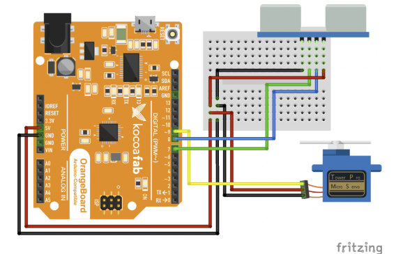

# Smart TrashBin

생활속에서 자주 쓰지만 그냥 쓰레기만 버리는 상자로만 인식됐던 휴지통을 자동으로 문이 열리고 닫히는 스마트한 휴지통으로 바꿔볼까요 

또한 WiFi를 이용하여 cayenne 과 연동하여 스마트폰으로 제어 하거나 카카오톡으로 휴지통을 비워달라고 메세지를 보낼수 있습니다. 

[코코아팹 예제](https://kocoafab.cc/make/view/209)를 참고로 했습니다. 

# 부품목록

|부품명 |상세 설명 |
|-|-|
|아두이노보드||
|서보모터|SG-90|
|초음파센서|HC-SR04|
|휴지통|다이소|

# 선연결

 출처 : 

# 제작 과정
## 초음파 센서 달기

휴지통의 배 쪽에는 구멍을 뚫어 초음파 센서가 들어갈 자리를 만들어요

## 서보 모터 달기

휴지통 뚜껑이 열리도록 서모 모터를 장착합니다 .드릴로 구명을 넓혀서 서모혼이 들어갈수 있도록 합니다.

서보모터를 고정 시킬 브라켓을 3D프린터로 (servo_bracket.stl)  출력하여 장착합니다.

피스로 고정하면 끝 ~ 참 

